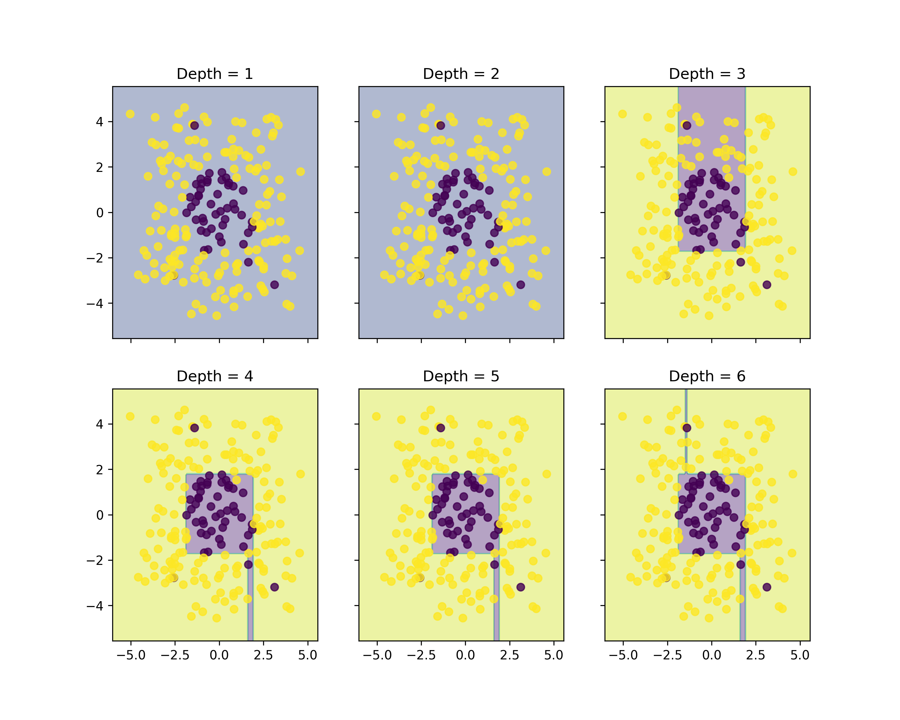
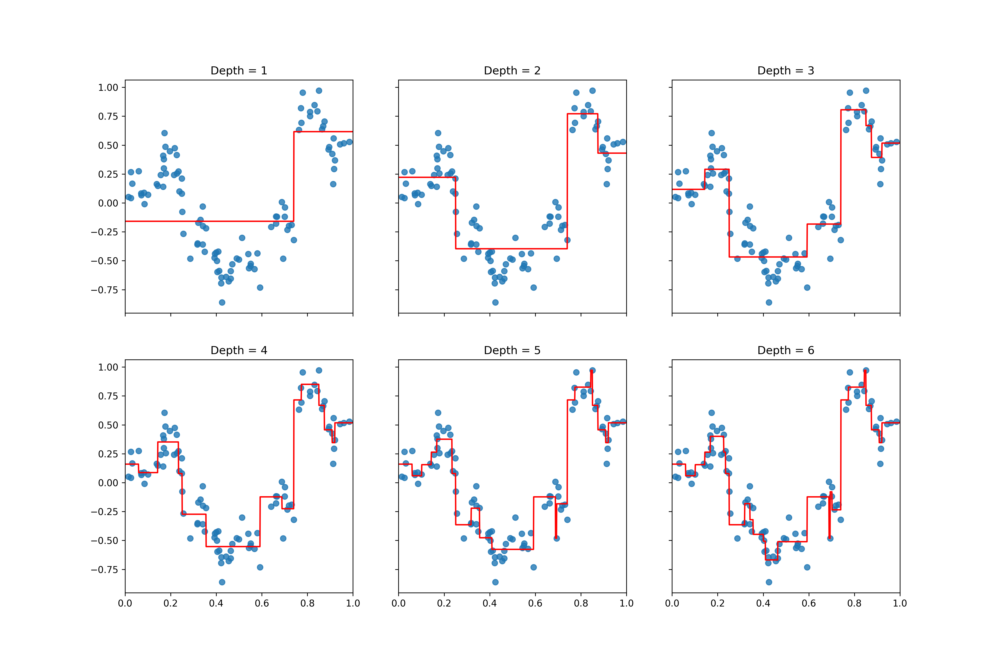
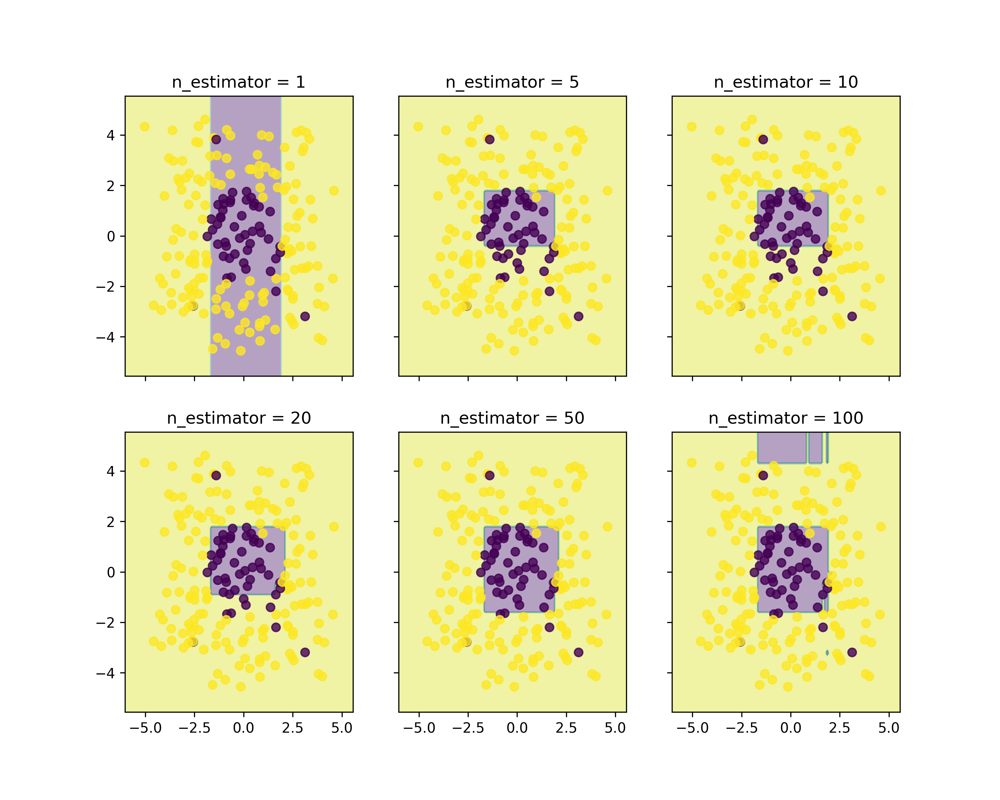
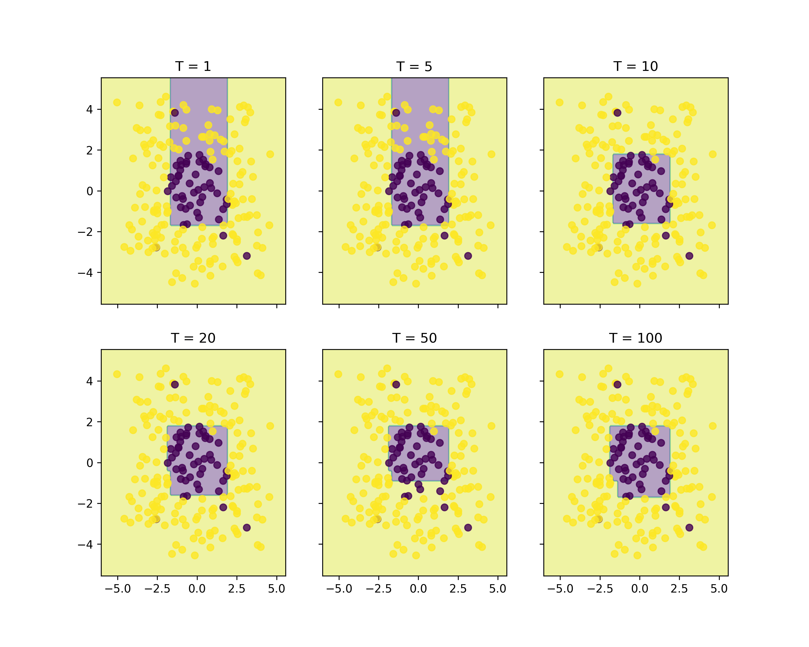
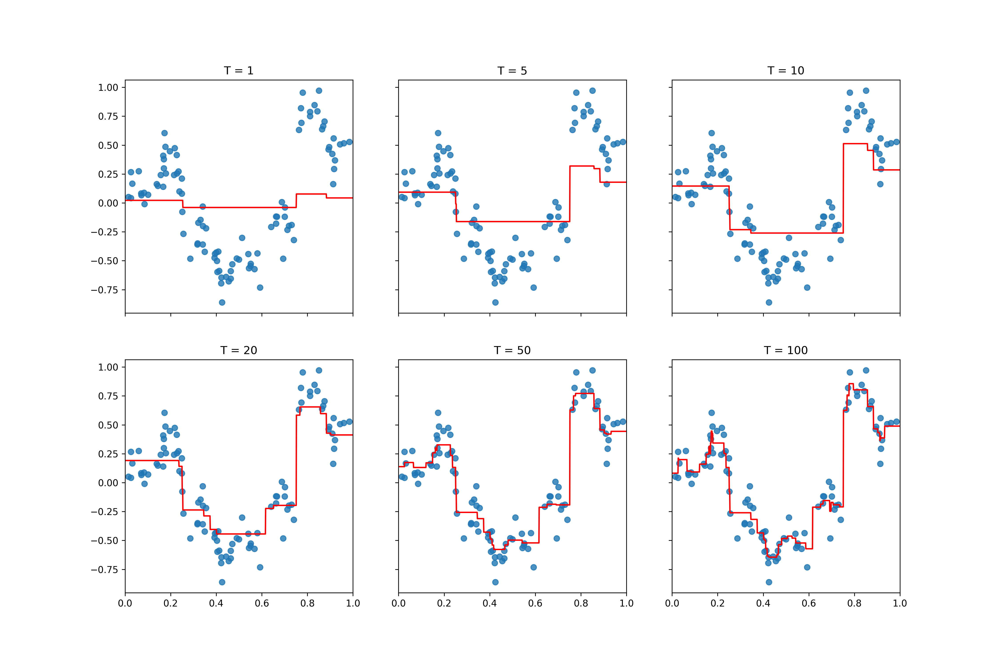

# ML2026 HW2: Decision Tree & Boosting

## Overview

This programming assignment covers two fundamental machine learning techniques:

1. **Decision Trees** — implemented from scratch for both classification and regression tasks.
2. **Gradient Boosting Machines (GBM)** — built using `scikit-learn`'s `DecisionTreeRegressor` as the base learner, with L2 and logistic loss functions.

---

## Files

| File | Description |
|------|-------------|
| `tree.py` | Decision tree implementation from scratch (classification + regression) |
| `boosting.py` | Gradient boosting implementation using sklearn base learners |
| `requirements.txt` | Python dependencies |
| `data/` | Training and test datasets for classification and regression |
| `output/` | Generated visualization plots |

---

## 1. Decision Tree (`tree.py`)

### Problem

Implement a recursive binary decision tree that learns axis-aligned splits by minimizing a loss function at each internal node.

### Implementation

**Core class: `DecisionTree`**

- A recursive tree where each node stores `split_id` (feature index), `split_value` (threshold), and either `leaf_value` or `left`/`right` child references.
- **Splitting algorithm:** For every feature and every possible split point between consecutive sorted values, compute the weighted loss of the left and right partitions. Choose the split that minimizes total loss compared to making the node a leaf.
- **Stopping criteria:** maximum depth reached, or number of samples ≤ `min_sample`.

**Classification Tree (`ClassificationTree`)**

- **Split criterion:** `entropy` or `gini` impurity.
- **Leaf prediction:** most common class label.
- **Helper functions:** `compute_entropy(label_array)` uses $H = -\sum p_k \log_2(p_k)$, and `compute_gini(label_array)` uses $G = 1 - \sum p_k^2$.

**Regression Tree (`RegressionTree`)**

- **Split criterion:** `mse` (variance) or `mae` (mean absolute deviation around the median).
- **Leaf prediction:** mean or median of target values.
- **Helper function:** `mean_absolute_deviation_around_median(y)` computes $\frac{1}{n}\sum |y_i - \text{median}(y)|$.

### Results

#### Classification — Decision Boundaries (Entropy)



The tree is trained at depths 1 through 6. As depth increases, the decision boundary becomes more complex, capturing finer details in the data. Shallow trees underfit (simple linear boundaries), while deeper trees can overfit noise.

#### Regression — Function Approximation



The regression tree approximates a noisy 1D function. At depth 1, the tree is a single split (step function). As depth increases, the piecewise-constant approximation sharpens, though it remains stepwise due to the nature of axis-aligned splits.

### Usage

```bash
python tree.py
```

This trains classification trees (entropy criterion, depths 1–6) and regression trees (MSE criterion, depths 1–6), saving plots to `output/DT_entropy.png` and `output/DT_regression.png`.

---

## 2. Gradient Boosting (`boosting.py`)

### Problem

Implement the gradient boosting framework introduced in *Section 3.5* of the lecture. At each round $t$, fit a weak learner $h_t$ to the negative gradient of the loss w.r.t. the current ensemble prediction $f_t$, then update $f_{t+1} = f_t + \eta \cdot h_t$.

### Implementation

**Core class: `GradientBoosting`**

- Maintains $f_t$ (cumulative prediction) and a list $[h_1, \dots, h_T]$ of weak learners.
- At each round $t$:
  1. Compute $g_t = \nabla_f L(y, f_t)$ using the specified gradient function.
  2. Fit an `sklearn.tree.DecisionTreeRegressor` to predict $-g_t$ from the input features.
  3. Update $f_t \leftarrow f_t + \eta \cdot h_t(x)$.
- Final prediction: $f_T(x) = \sum_{t=1}^T \eta \cdot h_t(x)$.

**Gradient functions:**

| Loss | Gradient $g_t$ | Use case |
|------|----------------|----------|
| L2 (MSE) | $f_t(x_i) - y_i$ | Regression & classification (via sign) |
| Logistic | $\frac{-y_i}{1 + \exp(y_i \cdot f_t(x_i))}$ | Binary classification |

### Results

#### Classification with L2 Loss



With a learning rate of 0.1 and `max_depth=2`, the model is tested at $T \in \{1, 5, 10, 20, 50, 100\}$. Even a single tree ($T=1$) provides a rough boundary; as $T$ grows, the ensemble refines the boundary, yielding a smooth, well-separated classification region at $T=100$.

#### Classification with Logistic Loss



Using logistic loss (`max_depth=3`, same learning rate), the decision boundary converges similarly, though the logistic loss tends to produce smoother boundaries due to its different weighting of misclassified points.

#### Regression with L2 Loss



On the 1D regression task (`max_depth=2`), the ensemble starts as a simple step function ($T=1$) and progressively adds detail. By $T=100$, the model closely tracks the underlying trend while smoothing through the noise.

### Usage

```bash
python boosting.py
```

This trains three GBM configurations and saves plots:
- `output/GBM_l2.png` — classification with L2 loss
- `output/GBM_logistic.png` — classification with logistic loss
- `output/GBM_regression.png` — regression with L2 loss

---

## Dependencies

Install the required packages:

```bash
pip install -r requirements.txt
```

Core dependencies: `numpy`, `matplotlib`, `scikit-learn`.

---

## Data

- `data/cls_train.txt` / `data/cls_test.txt` — 2D binary classification data (3 columns: x1, x2, y)
- `data/reg_train.txt` / `data/reg_test.txt` — 1D regression data (2 columns: x, y)

