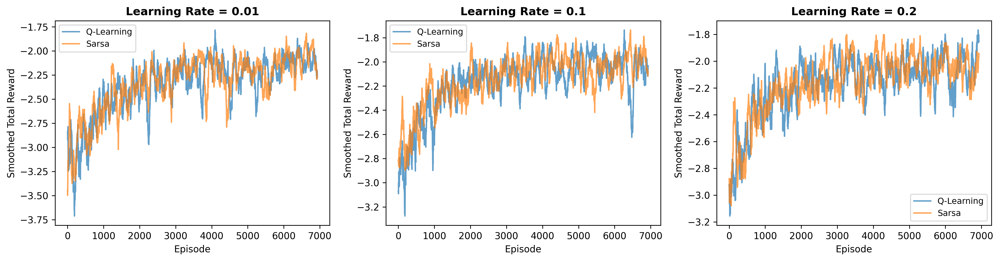
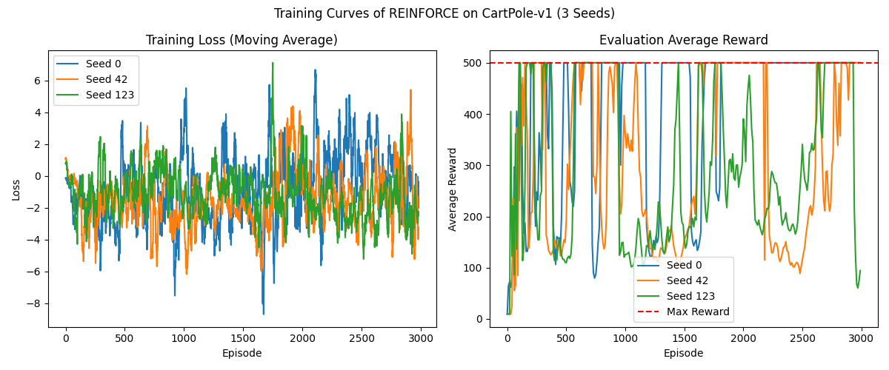
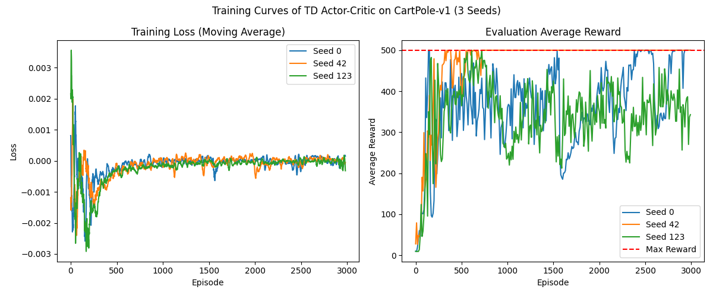

# ML2026 HW3: Reinforcement Learning

## Overview

This programming assignment covers two major paradigms in reinforcement learning:

1. **Value-Based Methods** — SARSA and Q-Learning on the FrozenLake environment.
2. **Policy Gradient Methods** — REINFORCE and TD Actor-Critic on the CartPole environment.

---

## Files

| File | Description |
|------|-------------|
| `sarsa_Q_learning/algorithms.py` | SARSA and Q-Learning implementations |
| `sarsa_Q_learning/utils.py` | Environment rendering and Q-function evaluation utilities |
| `sarsa_Q_learning/main.py` | Training script with learning rate comparison |
| `policy_gradient/policy_gradient.py` | REINFORCE and TD Actor-Critic implementations |
| `requirements.txt` | Python dependencies |

---

## 1. SARSA & Q-Learning (`sarsa_Q_learning/`)

### Problem

Implement on-policy (SARSA) and off-policy (Q-Learning) tabular TD learning algorithms on the **FrozenLake-v1** environment. The environment is a grid-world with slippery ice, where the agent must reach a goal while avoiding holes.

### Environment: FrozenLake-v1

- **Map:** 4×4 grid (`map_name="4x4"`, `is_slippery=True`)
- **States:** 16 discrete positions
- **Actions:** 4 (left, down, right, up)
- **Reward shaping** via `FrozenLakeRewardWrapper`:
  - +2 for reaching the goal
  - −1 for falling into a hole
  - −0.3 per step (to encourage shorter paths)

### Implementation

**Q-Learning (`QLearning`)**

- Off-policy TD control: $Q(s,a) \leftarrow Q(s,a) + \alpha \big[ r + \gamma \max_{a'} Q(s', a') - Q(s,a) \big]$
- Uses ε-greedy exploration with exponential decay (ε ← ε × 0.99 every 10 episodes).
- Update happens at every step within each episode.

**SARSA (`Sarsa`)**

- On-policy TD control: $Q(s,a) \leftarrow Q(s,a) + \alpha \big[ r + \gamma Q(s', a') - Q(s,a) \big]$
- The next action $a'$ is chosen using the same ε-greedy policy as the current action.

**Key difference:** Q-Learning uses the max over next Q-values (off-policy), while SARSA uses the actual next action's Q-value (on-policy), making SARSA more conservative in stochastic environments.

### Results



The plot compares smoothed total rewards across 7000 episodes for three learning rates (0.01, 0.1, 0.2). With the heavier step penalty (−0.3 per step):
- Both algorithms converge to similar performance levels.
- **lr=0.1** provides the best balance of speed and stability.
- Q-Learning often converges faster but with higher variance; SARSA is smoother due to its on-policy nature.

### Usage

```bash
cd sarsa_Q_learning
python main.py
```

Trains both algorithms with learning rates [0.01, 0.1, 0.2] and saves `lr_comparison_curves_more_penalty.png`.


---

## 2. Policy Gradient (`policy_gradient/`)

### Problem

Implement two policy gradient methods on the **CartPole-v1** environment:
1. **REINFORCE** — Monte Carlo policy gradient with discounted returns.
2. **TD Actor-Critic** — combines a policy network (actor) with a value network (critic) using TD error.

### Environment: CartPole-v1

- **State:** 4D continuous vector (cart position, velocity, pole angle, angular velocity)
- **Actions:** 2 (push left, push right)
- **Reward:** +1 per timestep the pole stays upright
- **Max reward per episode:** 500 (after 500 steps or when pole falls)

### Implementation

**Network Architectures**

- `MLP`: 2-layer feedforward (4→128→2) with ReLU, outputs action logits.
- `AC`: Shared-body actor-critic (4→128) with two heads — `pi` (128→2) for action logits and `v` (128→1) for state value.

**REINFORCE**

1. Collect a full episode trajectory $(s_t, a_t, r_t)$.
2. Compute discounted returns: $G_t = r_t + \gamma G_{t+1}$ (backward), then normalize.
3. Compute policy loss: $\mathcal{L} = -\sum_t \log \pi(a_t | s_t) \cdot G_t$.
4. Backpropagate and update the policy network.

**TD Actor-Critic (`TDActorCritic`)**

- Extends REINFORCE with the `AC` network.
- At each episode end:
  - **TD target:** $r_t + \gamma \cdot v(s_{t+1}) \cdot done_t$
  - **TD error:** $\delta_t = td\_target - v(s_t)$
  - **Policy loss:** $-\frac{1}{T}\sum_t \log \pi(a_t | s_t) \cdot \delta_t$ (δ detached)
  - **Value loss:** smooth L1 loss between $v(s_t)$ and detached TD target
- Total loss = policy_loss + value_loss.

### Results

#### REINFORCE (3 Seeds)



Left: training loss (moving average, window=20). Right: evaluation average reward every 10 episodes. REINFORCE converges reliably across all 3 seeds, reaching max reward (500) within ~1500 episodes.

#### TD Actor-Critic (3 Seeds)



TD Actor-Critic converges to the max reward faster than REINFORCE (~800 episodes), benefiting from the reduced variance of TD learning compared to Monte Carlo returns.

### Usage

```bash
cd policy_gradient
python policy_gradient.py
```

Set `AC = True` (line 230) for TD Actor-Critic or `AC = False` for REINFORCE. Trains over 3 seeds and saves the corresponding training curve plot.

---

## Dependencies

```bash
pip install -r requirements.txt
```

Core dependencies: `numpy`, `matplotlib`, `gymnasium`, `torch`.

---

## References

- Sutton & Barto, *Reinforcement Learning: An Introduction*, Chapters 6, 13
- [Gymnasium FrozenLake](https://gymnasium.farama.org/environments/toy_text/frozen_lake/)
- [Gymnasium CartPole](https://gymnasium.farama.org/environments/classic_control/cart_pole/)

